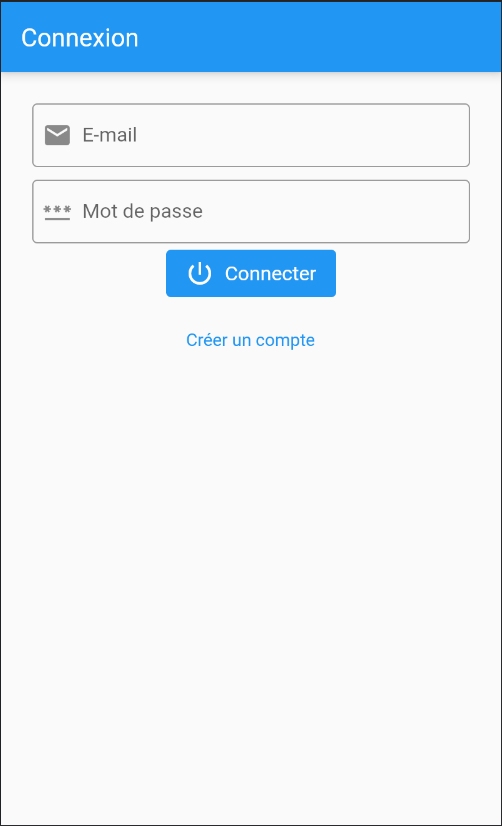
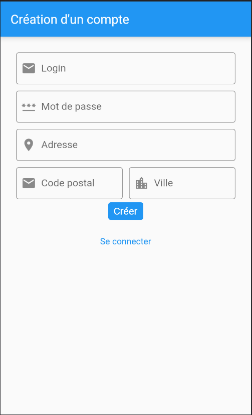
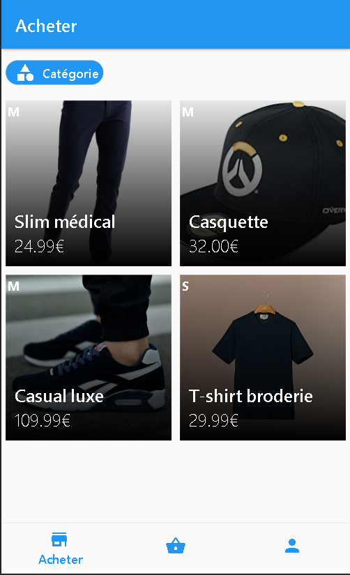
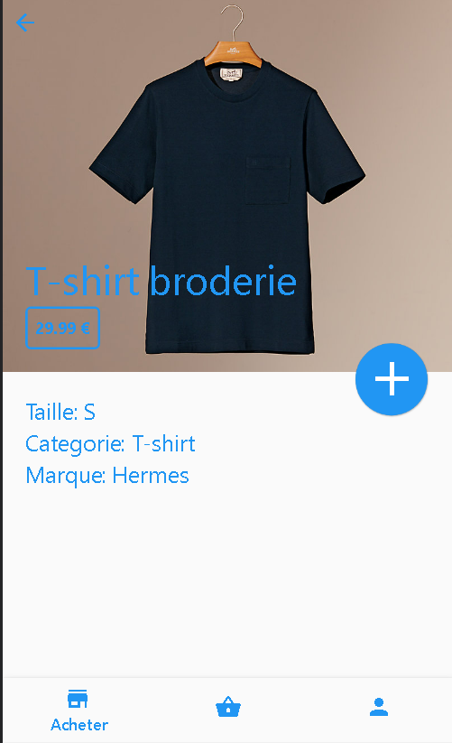
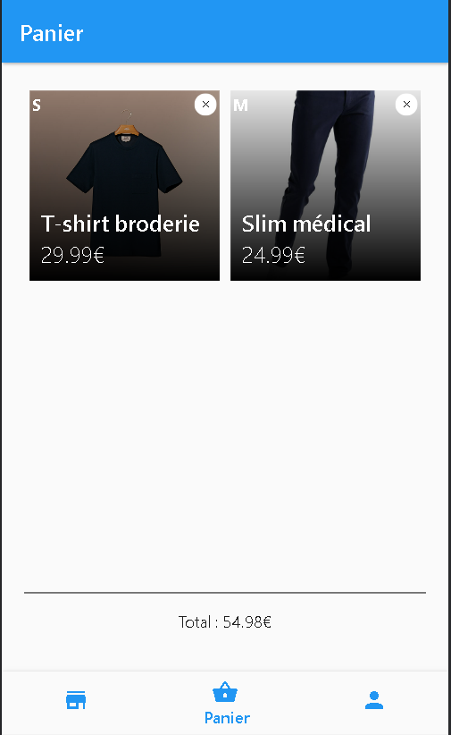
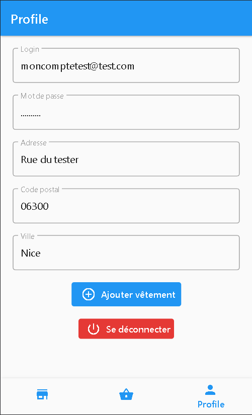

<div align="center">
    
    <h1>MIAGED</h1>
</div>

# Introduction
L’objectif de ce TP consiste à développer une version light de l’application Vinted (https://www.vinted.fr/). Celle-ci s’appelle « MIAGED ».</br></br>
Dans le fonctionnement actuel des entreprises, celle-ci définissent le plus souvent, dans le cadre du développement d’une application, une version MVP (Minimum viable product ➔ Produit minimum viable).</br>
Le MVP est la version d’un produit qui permet d’obtenir un maximum de retours client avec un minimum d’effort. Nous allons donc appliquer ce système est définir un MVP.
En parallèle, énormément d’entreprises passent aux méthodologies agiles et la rédaction de User Story.</br>
Nous allons donc appliquer ce formalisme pour exprimer les différents besoins. Chaque User Story composant le MVP sera préfixé de [MVP] dans son titre.</br>

Afin de lancer le projet correctement veuillez suivre les commandes suivante :
````console
flutter doctor
````
`````console
flutter pub get
`````
# Sommaire
- [Packages](#packages)
- [Système de routage](#système-de-routage)
- [Interface de login](#interface-de-connection-et-dinscription)
- [Liste de vêtements](#liste-de-vêtements)
- [Détail d'un vêtement](#détail-dun-vêtement)
- [Le panier](#le-panier)
- [Ajouter un nouveau vêtement](#ajouter-un-nouveau-vêtement)
# Packages
* [**Firebase**](https://firebase.flutter.dev)
* [**GoRouter**](https://pub.dev/packages/go_router)
* [**Multi Select Flutter**](https://pub.dev/packages/multi_select_flutter)
* [**Async**](https://api.dart.dev/stable/2.18.6/dart-async/dart-async-library.html)
* [**Badges**](https://pub.dev/packages/badges)
* [**RxDart**](https://pub.dev/packages/rxdart)
# Système de routage
Afin de naviguer facilement entre les pages et les elements de ***Flutter***,
un système de routage a été mis en place avec le package [*GoRouter*](https://pub.dev/packages/go_router).

Le routage est configurer dans le fichier *'router.dart'*, il possède un *ShellRoute* et 2 *GoRouter* classique.
- <u>**ShellRoute**</u>: Permet d'implementer un Widget de navigation et des routes enfants.
- <u>**GoRoute**</u>: Permet de définir le *path* et du Widget à générer.
# Interface de Connection et d'Inscription
Afin de ce connecter un formulaire est disponible avec 1 champ pour l'email comme identifiant du compte
et 2ème champ pour insérer le mode passe cacher par des points. Un bouton pour éxécuter la connection.

Un 2ème bouton existe afin de créer un compte, il est demandé un email, un mot de passe, l'adresse, la ville et le code postal de la ville.

Vous pouvez créer un compte afin d'accèder au service ou sinon utiliser le compte suivant:
- Compte : moncomptetest@test.com
- Mot de passe : azerty
<div style="display: flex; flex-direction: row; justify-content: center;">
    
    
</div>

# Liste de vêtements
Après la connexion une 1er page apparait, cette page affiche une liste de vêtements mis en ligne par d'autre utilisateur avec la taille, le prix et le titre.

Cette liste peut-être filtré par catégorie de vêtements grâce à un bouton ouvrant un dialogue.
Ce dialogue permet de selectionner un ou plusieurs catégories.
<div style="display: flex; flex-direction: row; justify-content: center;">
    
</div>

# Détail d'un vêtement
Pour avoir tout les détails des vêtement, il suffit de tapper (ou cliquer) sur la case du vêtement.
Cette action permet d'ouvrir une page enfant qui affichera tous les informations.
- Titre
- Prix
- Taille
- Marque
- Catégorie

La page contient 2 boutons dont un en haut à gauche pour revenir à la page précédente et un dernier au mis de la page pour ajouter le vétement dans le panier du compte.
<div style="display: flex; flex-direction: row; justify-content: center;">
    
</div>

# Le panier
En bas de l'application un navigateur permet d'accèder à 3 pages différents la 1er était la liste des vêtement et la 2ème la page "Panier".

La page panier permet d'avoir la liste des vêtements ajouter dans le panier par l'utilisateur. Elle possède la somme des prix des vetements dans le panier.
Les cases permettent d'accèder aux détails du vêtement ou gràce à la croix en haut à droite de la case d'enlever le vêtement du panier.

<div style="display: flex; flex-direction: row; justify-content: center;">
    
</div>

# Profil utilisateur
Un dernier bouton dans la barre de navigation permet d'accèder au profil de l'utilisateur.
Cette page possède bouton un premier permettant de ce déconnecter et un deuxième pour ajouter un vêtement.

<div style="display: flex; flex-direction: row; justify-content: center;">
    
</div>

# Ajouter un nouveau vêtement
Via le bouton "**Ajouter vêtement**", un formulaire s'ouvre afin afin de renseigner différente informations du vêtement.
Il faudra insérer les informations suivante:
* Nom
* Taille
* Prix
* Marque
* Lien HTTP d'une image

<div style="display: flex; flex-direction: row; justify-content: center;">
    
</div>
